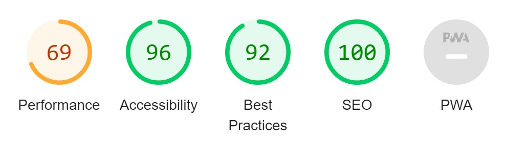

# JB Wildlife Prints

An online webshop for wildlife prints from photographer Joris Bomert.

 

## Development 
---------------
- This sites main purpose is to advertise and sell JB's photos to customers that are looking to buy beautiful prints of wild animals.  
- It's a B2C site that sells prints as a product to consumer, with a single payment.
- Payment methods are either by card (Stripe), or Swish( in Sweden only). Swish is a mobile app that's extremely popular in sweden. According to Swish, 64% of customers thinks that swish is an important payment option when they shop online. 
- The site will include a card payment method(stripe), shopping cart, filter image function and high quality images In the future it will also include 
a rating and comment system.
- I have planned both Swedish and English keywords, and these were suggested by the search engine.
    - Short-tail keywords:
        - Wildlife, wildlife in sweden, wildlife prints. Djur, natur, tavlor, foto.
    - Long-tail keywords :
        - Wildlife prints for sale, common wildlife in sweden, nature photography online shop. Stora tavlor djur, posters djur och natur. Köpa fotografier online. 

    - Keywords that I will use, based on wordtracker.com:
        - Wildlife photography (4.300), sweden wildlife (90), wildlife pictures (570)

- The site will link to following sites to increase SEO validation:
    - Svenska Rovdjursföreningen, a Swedish wildlife magazine that often publishes JB's photographs. 
    - Canon, whose products are used by JB to produce these beautiful photos and prints. 
- The link to this site will be published on the Facebook business page, and in a future realease also on Instagram.

### Users
- This sites user focus are people who appreciate wildlife, and would like to purchase a print of their choice from our webshop. 
- The best way to reach my users is through Facebook and Instagram, as there is hashtags and Facebook groups to ensure that it's the correct user group. These are also the best places for users to view wildlife content, as there is algorithm that ensures that the users only see what they are interested in.
- It's not difficult to find a web store that sells mass produced prints of wildlife. What is offered on this website however, is a chance to buy prints directly from a expert photographer. These prints are not part of a mass production, they are printed in limited amount to keep each image's unique value.
- Delivering this content will be tough, as the competition is high. The best way for us to achieve this without a commercial budget, is through social media, and by building a network.

### Sales 
- Art such as these photographs is not something that should be put on weekly sales as it lowers the unique value of treating/displaying it as a mass production. An exception would be for the holidays, as it is only once per year, and for a special occasion. 

### Goal
- The goal of this business is to create a site where users can easily and secure make a purchase of the unique prints from JB's collection. The intent is to have a fully functioning, good looking, trustworthy webstore. 
- Paid ads is not a priority as of this moment. Using free social platforms, and advertisement through social network will be good enough for now.

### SEO 
- To create the feeling of expertise and authoritativeness to users, I would like to display the prints in a real world enviroment. There are websites which generate a photo in a livingroom etc. This is not MVP however, but it is certainly important to implement. 
- Another important feature for trustworthiness is ratings and user comments. Not either MVP, but important for future.
- Purchasing a custom domain will increase trust and is important in the future.
- A picture is worth a thousand words. I believe using less text, and instead focusing on quality images and clear simple navigation is going to be the best approach for this site.

## Database model

 

### Mockup
- Mockup language may vary, this is because it was first planned to be a Swedish webshop. 
- It's very possible that the end product won't look exactly like the mockup due to technical issues or increased UX

- High quality landing page, clear purpose of the site is in the hero title section. To keep the image clean, I have not added a typical navigation bar. Instead there is two buttons, one for contact page and one directly to the webshop. 
- 3 reasons section where I present to the user what can be expected in terms of quality and service, as well as a section for the photographer JB to introduce himself to the user. 

- Bottom section of page will be same across all pages, a option for users to sign up for a newsletter, and a footer with social links and a nav element to the other pages. Once again, I have purposefully not added a typical navigation bar on top of the page, but instead, users can reach the pages from the footer on every page. 

- On mobile devices, the navigation is collapsed, to keep the hero image clean and for improved UX. The user can navigate to all pages from this dropdown as well.
- 3 reasons section is now below a image carousel, this to make it more clear to visitors on mobile devices what the purpose of the site is - photographs of wildlife.

- The webshop page contains a gallery of high quality images. If the user has not chosen a filter, all available prints are shown. Two filter options, mamals and birds. Later on in production, more filters could be added, such as filter by seasons. 
- The shopping bag icon :
    - If user has added a product to cart, this icon will be accessible on all pages.

- If the user selects an image, they get redirected to a new page. It has:
    - A larger preview of the photo
    - Next and previus arrows - this will display other photos of the same animal species, so that the user don't have to go back to select another yet similar product. 
    - Size options and responsive pricing. User selects which print size they would like, and the price updates accordingly.

- Checkout page contains a smaller preview of the product/s, amount, shipping cost and total cost. Users can edit amount or delete item on this page. To continue, user has to sign up/ sign in. This requirement is described next to the Continue button, so that the user knows that it is required before they press Continue.
- The authentitaction is planned to be handled inside a modal.

- Once user have gone through the authentication steps, they can now fill in the required fields for shipping and credit card details.
- If the user (in Sweden only) wishes to pay with Swish as mentioned earlier, they would have to contact JB, as Swish connects to a phone number. For privacy reasons I did not include JB's phone number. This is explained to the user on the page.
- When all the required fields have correct value, user can click Purchase button. A confirmation email is sent to the user. 

## Features
---------------------
### Existing Features
- Home page 
    - Users that visits the site is met with a high quality photo on the landing page that really draws the eye. 
    - To reduce the bounce rate, the page takes serveral things into concideration: 
        - The title of the website is short but describes clearly and quickly for the user what it's purpose is.
        - This site does not use a standard navigation bar to keep the picture clean, and to stick out from the rest. In the footer there is a navigation menu.
        - The three most important navigation options are shown here. Potential buyers will look for credibility before trusting a unknown page with money, and
        on the 'about' page they will get to know the webshop owner better. A page that lists ways to contact the seller also improves user trust. The last and
        most important navigation is the webshop button, brining the visitor to the webshop page. 
        - Origionally the page only had two navigation buttons, contact and webshop. But taking user experience into account, I implemented one extra, so that the user always can navigate back to the home page. The design of 'webshop' button also changed from the origional due to visibility issue. 

    - 3-reasons section is identical to the mockup design. Users can click on every word marked as bold, to visit a external site (in a new window) related to the section.
    - A small image carousel with descriptions on a automatic slider, this because some of my ux testers did not see it was a slider. User can still manually go back or to next image by using the default arrows. 

- Webshop 
    - A filter option for mamals and birds. The filter options are stored in the database, making it is easier to add more categories in the future. 
    - Some images are of a different crop ratio, and I have left it so on purpose to make it look like a art gallery wall. 
    - If a user selects a print, they get sent do print detail. 

- Print detail
    - A page where potential customers can : 
        - View the prints in a bigger size
        - Select paper size and see what the price of each print size would be. 
        - Select amount of prints.
        - Add print to cart. 
        - There is a limit set to 10 prints.  
- Cart 
    - When user adds a print to cart, a cart icon appears on all pages that the user would navigate to. 
    - The cart is a modal that displays the print image, name, size, cart total and how much is left until free shipping
     
    - The customer can also increase, decrease and delete items directly in this modal. 
    - There is a limit set to 10 prints. 

- Checkout 
    - A multi stage page, where customer starts off by reviewing their cart content and total price.
    - If customer is not signed in at the time, the customer will be requested to sign up/sign in first. 
    
    - Once customer has filled in the signup form they are redirected back to the checkout page. 
    - Next up is for the customer to fill in all the required fields to complete the shipping form, and lastly credit card details. 
    - Once all forms are filled and filed, the customer recives feedback that the purchase was sucessfully added.

- Remaining pages 
    - 'About', 'Contact', 'Pricing' and 'Delivery info' all have the same design and structure. Swish logo is present on all pages to increase credibility for
    Swedish users. 'Delivery info' has a privacy policy link, to respect gdpr.

- Footer
    - Newsletter signup form is visible throughout the entire webpage. 
    - Social media links. If this site had a google buissiness page, the google icon link would lead there. For now it leads to google.com.
    - The footer is visible throughout the entire page, and serves as a navigation bar as well. This to keep the landing image clean.
    - Admin/log in/log out navigation options:
        - If user is a admin, the navigation option to view a all orders listed here. 
        - If user is not signed in, the navigation option to sign in is listed here.
        - If user is signed in, the navigation option to log out is listed here. 

- Admin page frontend
    - If admin is signed in there is a additional page to view orders for easier order handeling. 
    -  

### Features left to implement
- In a future release I would:
    - Add a success message when user adds a item to cart. For now the only feedback there is, is that a shopping cart appears.
    - On checkout page and cart modal, give customer a error message if they try to add more than 10 of the same prints.
    - Add '*required' text output on the shipping form, for increased clarity for customer when they fill in this form. 
    - A rating system for each print
    - A user comment section, to improve site trustworthyness.
    - Setup the Stripe modal and webhooks and implement live keys for real payments. 
    - Authentication modal instead of user ending up on a different page. 
    - Authentication by social account. 
    - A custom domain and a google business page. 

## Testing 
--------------------
- The page has been thoroughly tested manually on:
    - The cart icon:
        - Is only displayed if a user has added a print to cart, as intended. Once visible, it displays the cart content to user in a modal. 
        - Increase, decrease and delete buttons works correctly. If user goes below 1 print, it's deleted from cart.
        - The free delivery treshold is tested and correctly reflects the purchase treshold to user.  
        - Continue to secure checkout button leads the user to checkout as intended, and the price calculator shows the correct price.
    - Checkout:
        - Increase, decrease and delete amount options works. If item gets deleted, checkout page is empty with a feedback message to the user. 
        - Print amount and price calculator is working correctly. 
        - Continue button is present, and handles authenticated/non authenticated requests as intended. 
        - Shipping form handles valid/invalid input as expected. Complete order option is present and working. If user presses backspace on the site, the user gets sent back to the shipping form. If user then tries to submit again, they recieve a server error 500.
    - All navigation works correctly: 
        - Login - leads to user authentication page
            - Routing works.
            - Responds to user with Allauths helpful feedback whenever there is a issue to sign in.
            - The option to sign up is present and the routing works. 
            - Forgot password option is present and working.
            - The button to sign in once all information is valid works correctly and signs in user.
        - Sign up
            - The routing to go to Sign In works and sends user to the Login page.
            - If user has entered a valid form when Sign Up is pressed, user is signed in.
            - If there is a invalid input from user, suchS as a 'already registered email', the issue is reflected back to the user thanks to Allauths helpful messages.
        - Home - leads to index page.
            - About, contact and webshop navigation leads users correctly. 
            - Canon and rovdjursföreningen external links works correctly and are opened in a new tab. 
            - The arrow slider function on the image carousel works correctly.
        - Contact - leads to contact page
            - Home, Contact and Webshop navigation leads users correctly.
        - Webshop - leads to webshop page
            - Filtering mamals and birds correctly. Mamals only shows mamals and birds only show bird prints to user. 
            - Each print navigation takes user to the corresponding print for preview.
            - Size option is responding correctly by showing the correct print price to size. User can increase prints up to 10. User can not insert a string or leave empty field. 
        - Pricing - leads to price page
            - Home, Contact and Webshop navigation leads users correctly.
        - Delivery info - leads to delivery info page
            - Home, Contact and Webshop navigation leads users correctly.
            - GDPR link present on site works and leads user to users privacy info section.
        - About - leads to about page
            - Home, Contact and Webshop navigation leads users correctly.
        - Authentication navbar:
            - Login option if user is not authenticated. If user is authenticated:
                - Authentication status reflected to user
                - My Orders option:
                    - Is empty if user has not completed a purchase
                    - If user has completed a purchase, it displays the list correctly to user of each order. 
                - Logout option present and working.
        - Footer:
            - The newsletter subscribe function setup through mailchimp works, however, no user feedback is present if a user types in a invalid input.
            - Facebook, Google, Instagram, LinkedIn and GitHub links works correctly and are opened in a new tab.
            - Authentication, Webshop, Pricing, Delivery Info, About and Contact all leads to the correct page. 
            - JBphotos.com link leads to the index page of the webshop as expected. 
    - All external links works and are opened in a new tab:
        - Canon link on index page leads to https://www.canon-europe.com/cameras/ and opens in a new tab
        - Svenska Rovdjursföreningen link on index page leads to https://rovdjur.se/ and opens in a new tab.
    
### Bugs
- On print detail page; if user submited a blank form the amount input, the page encountered an error. Solved by adding 'required' to form input. 
- Encountered a early bug where all users carts would be increased if another user added a product to cart. Once context was set up properly it dissapeared. 
#### Remaining bugs 
- After a successful purchase where the user lands on thanks_for_order page, if the user then clicks backspace on their mouse they get back to the checkout page again with the same products. 
- If user tries to add more than 10 of the same print and size, it's supposed to trigger a message for the user that they can not add more than 10. This does not happen now. 
- If a user tries to sign up to the newsletter and types in a invalid input, such as '444.com', no feedback is reflected to user to assist. The newsletter was setup with my own design but with Mailchimps logic, so somewhere I lost logic from their mail service. 

### Validator Testing
- CSS 
    - Direct input with (Jigsaw) validator found no errors, 2 warnings. 
- HTML 
    - Code passes through the W3C validator with no errors, 3 warnings.
- Accessibillity
    - In incognito mode I tested this page in devtools lighthouse
        

## Deployment
---------------

- The site was deployed by:
    - Setting up a external database on ElephantSQL.com:
        - Firstly, login/create a ElephantSQL account. Click on the '+ Create New Instance button'. Name your project and select the Tiny Turtle(Free) plan, and then 'Select Region'(for me it was EU-North-1). Once selected, press 'Review', and then 'Create Instance'
    - On Heroku.com, click 'New', Create New App. Choose a name and region, then click 'Create app'. Navigate to 'Settings' and find the 'Reveal Config Vars' button. Here, connect the ElephantSQL database by adding DATABASE_URL in the first form. From ElephantSQL.com page, copy the URL string (postgres://your_own_url_code) and paste it into the heroku config var form, to the right of the DATABASE_URL line. Click 'Add'.
    - For use of cloudinary as host for static files, navigate to cloudinary.com. You can sign in with your GitHub account. Under 'Media Library' , you can select 'Upload' to upload files manually. I uploaded and stored static files in the database however, so I had to run  ' python manage.py collectstatic' (at the very end of my project, to not run into any deployment issues to Heroku). 
    - Create a .env file in root directory. It needs to contain the CLOUDINARY_URL key that you find on your cloudinary account, the DATABASE_URL key (the one from ElephantSQL), and your very own SECRET_KEY key. The .env file should look similar to this if done right:
        - CLOUDINARY_URL=cloudinary://cloudinary_generated_key
        - DATABASE_URL=postgres://your_elephantSQL_url_key
        - SECRET_KEY=your_own_secret_key_key
    - Remember to not share or post these keys anywhere else in the code but in the .env file.
    - Update requirements.txt by typing pip3 freeze --local > requirements.txt
    - Back on Heroku under Config Vars, add the CLOUDINARY_URL and SECRET_KEY keys into the config var list. 
    - Before deploying to heroku, make sure that DEBUG is set to FALSE in the projects settings file. 
    - Underneath Deploy on heroku, selecting deployment method: GitHub
    - Connect repository from GitHub
    - Choose main branch, then click on Deploy Branch

## Facebook
---------------

## 404 page

## Technology used 
------------

- Django
- ElephantSql
- Allauth
- Jquery
- Heroku
- Bootstrap
- Fontawesome
- Cloudinary
- Stripe

## Credits
---------------
- Code for styling the prints in the webshop was based on code from CI project 'Boutique Ado' 
- To setup a admin path for frontend in a secure way, I found how to add a decorator for admin here- https://stackoverflow.com/questions/12003736/django-login-required-decorator-for-a-superuser
- Senior developer Joris Bomert helped me with:
    - Adding logic for the admin page on frontend.
    - Applying the decorator correctly for superuser.
    - The custom js code to generate messages on cart if user tries to add more than 10 prints.
    - Assisting with the connection between product,size,prize and the database models.
    - How to set up the shipping form function.
- The entire setup for Stripe payments was implemented fromCI project 'Boutique Ado' walkthrough videos. 
- Tutor support helped me with failed deploys caused by cloudinary. 

### Content
- For mockup, 'moqups.com' was used. This page offered 400 objects for free, it's easy to use and learn, and offers great tools for project planning. For future projects I would concider purchase upgraded plan to not have any limitations. 
- All photos used on this page is by photographer Joris Bomert with his permission.
- https://ui.dev/amiresponsive used to generate the media query image at the top of this readme. 